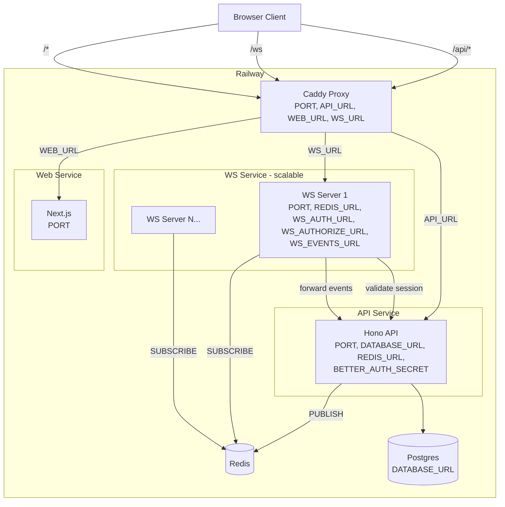

# WebSocket Server

A standalone Bun WebSocket server that acts as a stateless pub/sub relay between clients and the API, using Redis for horizontal scaling.

## Architecture



## How It Works

1. **Client connects** to `/ws` — Caddy proxies to a WS server instance
2. **WS server authenticates** by calling `GET {WS_AUTH_URL}` with the client's cookies
3. **Client subscribes** to topics — WS server calls `POST {WS_AUTHORIZE_URL}` to check access
4. **Client sends messages** — WS server forwards to `POST {WS_EVENTS_URL}` for the API to process
5. **API publishes events** to Redis — all WS server instances fan out to subscribed clients

The WS server contains **zero business logic**. All domain logic belongs in the API.

## Quick Start

```bash
# 1. Start Redis (required — the WS server won't work without it)
docker compose up -d redis

# 2. Start all services (from repo root)
bun dev
```

If Redis isn't running you'll see:

```
[redis] connection failed — is Redis running? (retrying every 0.5s)
```

Start Redis with `docker compose up -d redis` and the server will reconnect automatically.

## Environment Variables

### Local Development (`.env` at repo root)

| Variable | Value | Purpose |
|---|---|---|
| `REDIS_URL` | `redis://localhost:6379` | Redis connection |
| `WS_AUTH_URL` | `http://localhost:3001/api/auth/get-session` | Session validation |
| `WS_AUTHORIZE_URL` | `http://localhost:3001/api/ws/authorize` | Topic authorization |
| `WS_EVENTS_URL` | `http://localhost:3001/api/ws/events` | Client message forwarding |

`PORT` is set to `3002` in the dev script (not in `.env`, to avoid conflicting with the API's port).

Redis must be running locally via `docker compose up -d redis` before starting the WS server.

### Railway Production (per-service)

| Variable | Caddy | API | WS Server | Web |
|---|---|---|---|---|
| `PORT` | Railway sets | Railway sets | Railway sets | Railway sets |
| `API_URL` | yes | - | - | - |
| `WEB_URL` | yes | - | - | - |
| `WS_URL` | yes | - | - | - |
| `REDIS_URL` | - | yes | yes | - |
| `DATABASE_URL` | - | yes | - | - |
| `BETTER_AUTH_SECRET` | - | yes | - | - |
| `WS_AUTH_URL` | - | - | yes | - |
| `WS_AUTHORIZE_URL` | - | - | yes | - |
| `WS_EVENTS_URL` | - | - | yes | - |

In Railway, `WS_AUTH_URL` / `WS_AUTHORIZE_URL` / `WS_EVENTS_URL` use the API's **internal Railway URL** (private networking).

## Horizontal Scaling

Scale by increasing `numReplicas` in `railway.json`. Each instance subscribes to Redis independently — clients can land on any instance and receive the same events.

## Message Protocol

### Client to Server

```json
{ "type": "subscribe", "topic": "chat:room-42" }
{ "type": "unsubscribe", "topic": "chat:room-42" }
{ "type": "message", "topic": "chat:room-42", "data": { ... } }
```

### Server to Client

```json
{ "type": "subscribed", "topic": "chat:room-42" }
{ "type": "unsubscribed", "topic": "chat:room-42" }
{ "type": "event", "topic": "chat:room-42", "data": { ... } }
{ "type": "error", "code": "unauthorized", "message": "Not allowed" }
```

## Example Code vs Infrastructure

**Example code (remove when building your app):**
- `apps/web/src/app/chat/` — example chat page
- Chat-specific logic inside `apps/api/src/routes/ws.ts` (replace the logic, keep the endpoints)
- `scripts/seed.ts` — example test users

**Infrastructure (keep):**
- `apps/ws/` — the entire WebSocket server
- `apps/api/src/routes/ws.ts` — the `/api/ws/authorize` and `/api/ws/events` endpoints (replace the logic inside)
- `apps/web/src/hooks/use-websocket.ts` — WebSocket client hook with auto-reconnect

## Adding a New Real-Time Feature

1. Add authorization logic in `POST /api/ws/authorize` for your new topic pattern
2. Add event handling in `POST /api/ws/events` for messages on that topic
3. Use `publishEvent(topic, data)` from `apps/api/src/lib/redis.ts` anywhere in the API to push events
4. Subscribe to the topic from the client using the `useWebSocket` hook

Do NOT modify `apps/ws/` for business logic.

## LLM Snippet

Copy-paste this into your prompt when working with an LLM on this project:

~~~
## WebSocket Architecture

This project has a standalone WebSocket server at apps/ws/.
It is a stateless relay — it does NOT contain business logic.

Data flow:
1. Client connects to /ws (Caddy proxies to WS server)
2. WS server validates session by calling GET {WS_AUTH_URL} with the client's cookies
3. Client sends { type: "subscribe", topic: "..." } — WS server calls POST {WS_AUTHORIZE_URL} to check access
4. Client sends { type: "message", topic: "...", data: {...} } — WS server forwards to POST {WS_EVENTS_URL}
5. API processes business logic and does PUBLISH to Redis
6. All WS server instances subscribed to that topic fan out to their local clients

Message protocol (client to server):
  { type: "subscribe", topic: string }
  { type: "unsubscribe", topic: string }
  { type: "message", topic: string, data: any }

Message protocol (server to client):
  { type: "subscribed", topic: string }
  { type: "unsubscribed", topic: string }
  { type: "event", topic: string, data: any }
  { type: "error", code: string, message: string }

To add a new real-time feature:
1. Add authorization logic in POST /api/ws/authorize for your new topic pattern
2. Add event handling in POST /api/ws/events for messages on that topic
3. Use publishEvent(topic, data) from apps/api/src/lib/redis.ts to push events
4. Subscribe to the topic from the client using the useWebSocket hook

Do NOT modify apps/ws/ for business logic. All domain logic belongs in apps/api/.
~~~
