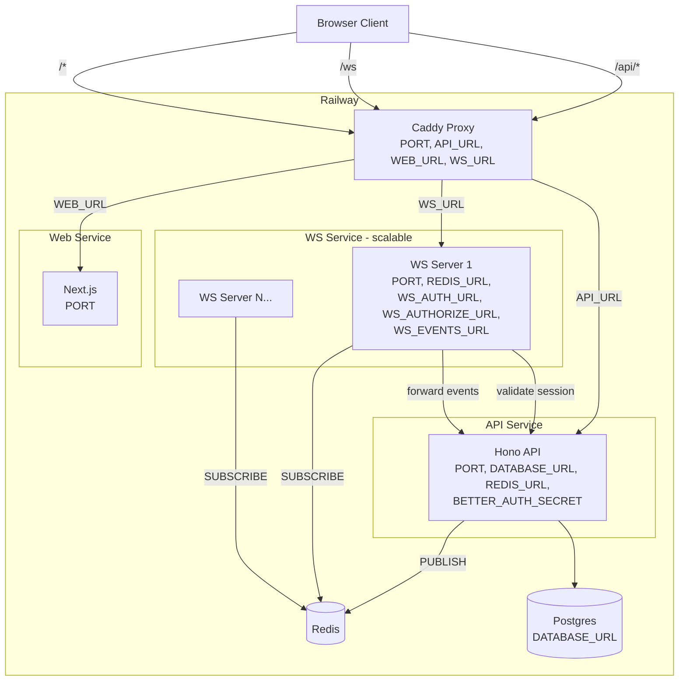

# WebSocket Server

A standalone Bun WebSocket server that acts as a stateless pub/sub relay between clients and the API, using Redis for horizontal scaling.

## Architecture


```mermaid
graph TB
    Client[Browser Client]

    subgraph Railway
        Caddy[Caddy Proxy<br/>PORT, API_URL, WEB_URL, WS_URL]

        subgraph API Service
            API[Hono API<br/>PORT, DATABASE_URL, REDIS_URL,<br/>BETTER_AUTH_SECRET]
        end

        subgraph WS Service - scalable
            WS1[WS Server 1<br/>PORT, REDIS_URL,<br/>WS_AUTH_URL, WS_AUTHORIZE_URL,<br/>WS_EVENTS_URL]
            WS2[WS Server N...]
        end

        Redis[(Redis)]
        Postgres[(Postgres<br/>DATABASE_URL)]

        subgraph Web Service
            Web[Next.js<br/>PORT]
        end
    end

    Client -->|/api/*| Caddy
    Client -->|/ws| Caddy
    Client -->|/*| Caddy
    Caddy -->|API_URL| API
    Caddy -->|WS_URL| WS1
    Caddy -->|WEB_URL| Web
    API -->|PUBLISH| Redis
    WS1 -->|SUBSCRIBE| Redis
    WS2 -->|SUBSCRIBE| Redis
    WS1 -->|validate session| API
    WS1 -->|forward events| API
    API --> Postgres
```

## How It Works

1. **Client connects** to `/ws` — Caddy proxies to a WS server instance
2. **WS server authenticates** by calling `GET {WS_AUTH_URL}` with the client's cookies
3. **Client subscribes** to topics — WS server calls `POST {WS_AUTHORIZE_URL}` to check access
4. **Client sends messages** — WS server forwards to `POST {WS_EVENTS_URL}` for the API to process
5. **API publishes events** to Redis — all WS server instances fan out to subscribed clients

The WS server contains **zero business logic**. All domain logic belongs in the API.

### Auth failure taxonomy

Upgrade-time auth distinguishes three failure modes instead of collapsing
everything into 401:

- **401 Unauthorized** — the session was genuinely rejected (no/invalid session and no guest identity). Clients should stop.
- **502 WS auth contract violation** — the API's auth payload shape doesn't match what the WS server expects (deploy mismatch). Logged with the auth path and response keys.
- **503 WS auth unavailable** — the API couldn't be reached (restart, network blip). Clients should retry.

### Presence

Presence ("who is online") is aggregated across WS instances through Redis:
each instance writes its local roster into a per-topic hash
(`presence:{topic}`, field = instance id) and publishes a `presence-sync`
nudge; every instance then merges all rosters (stale-pruned, deduped,
deterministically sorted) and pushes one `{ type: "presence", topic, users }`
message to its local subscribers. A heartbeat re-stamps rosters every 15s so
users on a crashed instance age out within 45s. The merge logic lives in
`src/presence.ts` with unit tests.

### Backplane control messages

Redis payloads are kind-discriminated envelopes (see `RealtimeMessage` in
`@app/shared`), so the API can instruct all WS instances rather than only
relay data. Helpers in `apps/api/src/lib/redis.ts`:

- `publishEvent(topic, data)` — fan `data` out to every subscriber (`{ kind: "event", data }`)
- `publishDisconnectUser(topic, userId)` — close that user's sockets on every instance with close code `4001` (clients do not auto-reconnect)
- `publishRevalidateTopic(topic)` — every instance re-runs `POST {WS_AUTHORIZE_URL}` once per subscribed user and force-unsubscribes anyone whose access was revoked (the client receives an `access_revoked` error). Sweeps are debounced 300 ms per topic, a message that lands mid-sweep queues exactly one follow-up, and at most 8 authorize calls are in flight per sweep — so a burst of permission changes costs one or two sweeps, not one per message, and a large topic can't flood the API. The scheduler lives in `src/revalidate-scheduler.ts` with unit tests; per-topic state is dropped when the topic's last local subscriber leaves.

Envelopes may carry an additive `_otel` field with W3C trace context so one
trace spans api → redis → ws → clients; consumers switch on `kind` and
ignore it.

Payloads with an unrecognized or malformed `kind` are logged and dropped —
never rebroadcast to clients — so when adding a new control kind, deploy the
WS service before the API starts publishing it. Only payloads without a
`kind` field at all (direct publishes that predate the envelope) are fanned
out as raw event data.

## Quick Start

```bash
# 1. Start Redis (required — the WS server won't work without it)
docker compose up -d redis

# 2. Start all services (from repo root)
bun dev
```

If Redis isn't running you'll see:

```
[redis] connection failed — is Redis running? (retrying every 0.5s)
```

Start Redis with `docker compose up -d redis` and the server will reconnect automatically.

Locally, `apps/web/next.config.ts` rewrites `/ws` to `WS_INTERNAL_URL` (default `http://localhost:3002`), so Caddy is not needed for `bun dev`.

## Environment Variables

### Local Development (`.env` at repo root)

| Variable | Value | Purpose |
|---|---|---|
| `REDIS_URL` | `redis://localhost:6379` | Redis connection |
| `WS_AUTH_URL` | `http://localhost:3001/api/auth/get-session` | Session validation |
| `WS_AUTHORIZE_URL` | `http://localhost:3001/api/ws/authorize` | Topic authorization |
| `WS_EVENTS_URL` | `http://localhost:3001/api/ws/events` | Client message forwarding |

`PORT` is set to `3002` in the dev script (not in `.env`, to avoid conflicting with the API's port).

Redis must be running locally via `docker compose up -d redis` before starting the WS server.

### Railway Production (per-service)

| Variable | Caddy | API | WS Server | Web |
|---|---|---|---|---|
| `PORT` | Railway sets | Railway sets | Railway sets | Railway sets |
| `API_URL` | yes | - | - | - |
| `WEB_URL` | yes | - | - | - |
| `WS_URL` | yes | - | - | - |
| `REDIS_URL` | - | yes | yes | - |
| `DATABASE_URL` | - | yes | - | - |
| `BETTER_AUTH_SECRET` | - | yes | - | - |
| `WS_AUTH_URL` | - | - | yes | - |
| `WS_AUTHORIZE_URL` | - | - | yes | - |
| `WS_EVENTS_URL` | - | - | yes | - |

In Railway, `WS_AUTH_URL` / `WS_AUTHORIZE_URL` / `WS_EVENTS_URL` use the API's **internal Railway URL** (private networking).

## Horizontal Scaling

Scale by increasing `numReplicas` in `railway.json`. Each instance subscribes to Redis independently — clients can land on any instance and receive the same events.

## Message Protocol

### Client to Server

```json
{ "type": "subscribe", "topic": "chat:room-42" }
{ "type": "unsubscribe", "topic": "chat:room-42" }
{ "type": "message", "topic": "chat:room-42", "data": { ... } }
```

### Server to Client

```json
{ "type": "subscribed", "topic": "chat:room-42" }
{ "type": "unsubscribed", "topic": "chat:room-42" }
{ "type": "event", "topic": "chat:room-42", "data": { ... } }
{ "type": "presence", "topic": "chat:room-42", "users": [{ "id": "u1", "name": "Amy", "isGuest": false }] }
{ "type": "error", "code": "unauthorized", "message": "Not allowed" }
```

### Close codes

Application close codes (4000-4999) mean the server ended the socket on
purpose — the client hook reports them via `onServerClose` and does **not**
auto-reconnect:

| Code | Meaning |
|---|---|
| `4001` | Disconnected by server (e.g. user kicked/removed) |

## Example Code vs Infrastructure

**Example code (remove when building your app):**
- `apps/web/src/app/chat/` — example chat page
- Chat-specific logic inside `apps/api/src/routes/ws.ts` (replace the logic, keep the endpoints)
- `apps/api/src/db/seed.ts` — example test users (run via `bun run db:seed`; also remove the `db:seed` scripts in `apps/api/package.json` and the root `package.json`, and the `db:seed` task in `turbo.json`)

**Infrastructure (keep):**
- `apps/ws/` — the entire WebSocket server
- `apps/api/src/routes/ws.ts` — the `/api/ws/authorize` and `/api/ws/events` endpoints (replace the logic inside)
- `apps/web/src/hooks/use-websocket.ts` — WebSocket client hook: auto-reconnect with jittered backoff; reconnects immediately when the network returns or the tab becomes visible; never after a 4xxx close

## Adding a New Real-Time Feature

1. Add authorization logic in `POST /api/ws/authorize` for your new topic pattern
2. Add event handling in `POST /api/ws/events` for messages on that topic
3. Use `publishEvent(topic, data)` from `apps/api/src/lib/redis.ts` anywhere in the API to push events
4. Subscribe to the topic from the client using the `useWebSocket` hook
5. Pass `onReconnect` to `useWebSocket` and refetch whatever the topic feeds; surface a refetch failure to the user (the socket has no replay buffer)

Do NOT modify `apps/ws/` for business logic.

## LLM Snippet

Copy-paste this into your prompt when working with an LLM on this project:

~~~
## WebSocket Architecture

This project has a standalone WebSocket server at apps/ws/.
It is a stateless relay — it does NOT contain business logic.

Data flow:
1. Client connects to /ws (Caddy proxies to WS server)
2. WS server validates session by calling GET {WS_AUTH_URL} with the client's cookies
3. Client sends { type: "subscribe", topic: "..." } — WS server calls POST {WS_AUTHORIZE_URL} to check access
4. Client sends { type: "message", topic: "...", data: {...} } — WS server forwards to POST {WS_EVENTS_URL}
5. API processes business logic and does PUBLISH to Redis
6. All WS server instances subscribed to that topic fan out to their local clients

Message protocol (client to server):
  { type: "subscribe", topic: string }
  { type: "unsubscribe", topic: string }
  { type: "message", topic: string, data: any }

Message protocol (server to client):
  { type: "subscribed", topic: string }
  { type: "unsubscribed", topic: string }
  { type: "event", topic: string, data: any }
  { type: "presence", topic: string, users: { id, name, isGuest }[] }
  { type: "error", code: string, message: string }

Redis backplane envelopes (API -> WS instances, see RealtimeMessage in @app/shared):
  { kind: "event", data: any }            fan out to subscribers
  { kind: "disconnect-user", userId }     close that user's sockets everywhere (code 4001)
  { kind: "revalidate-topic" }            re-run authorization for every subscriber (debounced per topic)
  { kind: "presence-sync" }               re-merge and re-broadcast presence

To add a new real-time feature:
1. Add authorization logic in POST /api/ws/authorize for your new topic pattern
2. Add event handling in POST /api/ws/events for messages on that topic
3. Use publishEvent(topic, data) from apps/api/src/lib/redis.ts to push events
   (publishDisconnectUser / publishRevalidateTopic for control messages)
4. Subscribe to the topic from the client using the useWebSocket hook
5. Pass onReconnect to useWebSocket and refetch whatever the topic feeds;
   surface a refetch failure to the user (the socket has no replay buffer)

Do NOT modify apps/ws/ for business logic. All domain logic belongs in apps/api/.
~~~
