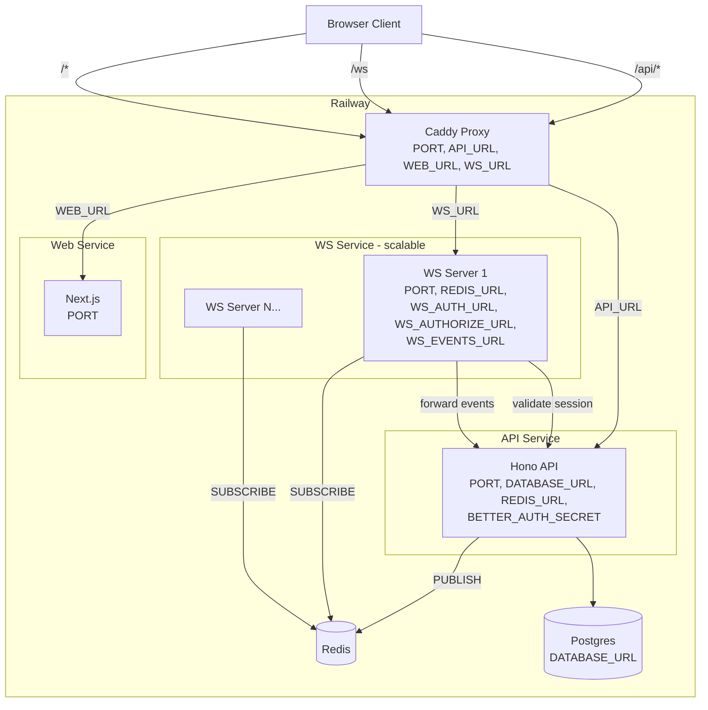

# WebSocket Server Implementation Plan

> **For agentic workers:** REQUIRED SUB-SKILL: Use superpowers:subagent-driven-development (recommended) or superpowers:executing-plans to implement this plan task-by-task. Steps use checkbox (`- [ ]`) syntax for tracking.

**Goal:** Add a standalone Bun WebSocket server that acts as a stateless pub/sub relay, backed by Redis, with a chat example demonstrating the full data flow.

**Architecture:** The WS server sits behind Caddy at `/ws`, authenticates via the API, and uses Redis pub/sub for horizontal scaling. The API publishes events to Redis; WS server instances subscribe and fan out to local clients. All business logic stays in the API.

**Tech Stack:** Bun, ioredis, Hono (API routes only), Redis 7, Next.js (chat page)

**Spec:** `docs/superpowers/specs/2026-03-29-websocket-server-design.md`

---

### Task 1: WS Server — Project Scaffolding

**Files:**
- Create: `apps/ws/package.json`
- Create: `apps/ws/tsconfig.json`
- Create: `apps/ws/src/protocol.ts`

- [ ] **Step 1: Create `apps/ws/package.json`**

```json
{
  "name": "@app/ws",
  "version": "0.0.1",
  "private": true,
  "type": "module",
  "scripts": {
    "dev": "PORT=3002 bun --env-file=../../.env --watch src/index.ts",
    "build": "bun build src/index.ts --outdir dist --target bun --production",
    "start": "bun dist/index.js",
    "lint": "tsc --noEmit"
  },
  "dependencies": {
    "ioredis": "^5.7.0"
  },
  "devDependencies": {
    "@types/bun": "^1.3.10",
    "typescript": "^5.9.3"
  }
}
```

- [ ] **Step 2: Create `apps/ws/tsconfig.json`**

```json
{
  "extends": "../../tsconfig.base.json",
  "compilerOptions": {
    "outDir": "./dist",
    "rootDir": "./src"
  },
  "include": ["src"]
}
```

- [ ] **Step 3: Create `apps/ws/src/protocol.ts`**

This defines the message types for the entire WS protocol — shared source of truth.

```typescript
// --- Client → Server ---

export interface SubscribeMessage {
  type: "subscribe";
  topic: string;
}

export interface UnsubscribeMessage {
  type: "unsubscribe";
  topic: string;
}

export interface ClientDataMessage {
  type: "message";
  topic: string;
  data: unknown;
}

export type ClientMessage =
  | SubscribeMessage
  | UnsubscribeMessage
  | ClientDataMessage;

// --- Server → Client ---

export interface SubscribedMessage {
  type: "subscribed";
  topic: string;
}

export interface UnsubscribedMessage {
  type: "unsubscribed";
  topic: string;
}

export interface EventMessage {
  type: "event";
  topic: string;
  data: unknown;
}

export interface ErrorMessage {
  type: "error";
  code: string;
  message: string;
}

export type ServerMessage =
  | SubscribedMessage
  | UnsubscribedMessage
  | EventMessage
  | ErrorMessage;

// --- Parsing ---

const VALID_CLIENT_TYPES = new Set(["subscribe", "unsubscribe", "message"]);

export function parseClientMessage(raw: string): ClientMessage | null {
  try {
    const msg = JSON.parse(raw);
    if (
      typeof msg !== "object" ||
      msg === null ||
      !VALID_CLIENT_TYPES.has(msg.type) ||
      typeof msg.topic !== "string" ||
      msg.topic.length === 0
    ) {
      return null;
    }
    return msg as ClientMessage;
  } catch {
    return null;
  }
}

// --- Connection Data ---

export interface WsData {
  userId: string;
  sessionId: string;
  userName: string;
}
```

- [ ] **Step 4: Install dependencies**

Run: `cd /Users/cameronosborn/Documents/Dev/bun-template && bun install`
Expected: installs ioredis in apps/ws

- [ ] **Step 5: Verify TypeScript compiles**

Run: `cd /Users/cameronosborn/Documents/Dev/bun-template/apps/ws && bunx tsc --noEmit`
Expected: no errors

- [ ] **Step 6: Commit**

```bash
git add apps/ws/package.json apps/ws/tsconfig.json apps/ws/src/protocol.ts bun.lock
git commit -m "feat(ws): scaffold websocket server package with protocol types"
```

---

### Task 2: WS Server — Auth Module

**Files:**
- Create: `apps/ws/src/auth.ts`

- [ ] **Step 1: Create `apps/ws/src/auth.ts`**

This module validates sessions by calling the API. It returns user info on success, null on failure.

```typescript
export interface AuthUser {
  id: string;
  name: string;
  email: string;
}

export interface AuthResult {
  user: AuthUser;
  sessionId: string;
}

const authUrl = process.env.WS_AUTH_URL;

if (!authUrl) {
  throw new Error("WS_AUTH_URL environment variable is required");
}

export async function validateSession(
  cookieHeader: string
): Promise<AuthResult | null> {
  try {
    const response = await fetch(authUrl!, {
      method: "GET",
      headers: {
        cookie: cookieHeader,
      },
    });

    if (!response.ok) {
      return null;
    }

    const data = (await response.json()) as {
      session?: { id: string };
      user?: { id: string; name: string; email: string };
    };

    if (!data.session?.id || !data.user?.id) {
      return null;
    }

    return {
      user: {
        id: data.user.id,
        name: data.user.name,
        email: data.user.email,
      },
      sessionId: data.session.id,
    };
  } catch {
    return null;
  }
}
```

- [ ] **Step 2: Verify TypeScript compiles**

Run: `cd /Users/cameronosborn/Documents/Dev/bun-template/apps/ws && bunx tsc --noEmit`
Expected: no errors

- [ ] **Step 3: Commit**

```bash
git add apps/ws/src/auth.ts
git commit -m "feat(ws): add auth module for session validation via API"
```

---

### Task 3: WS Server — Topic Manager

**Files:**
- Create: `apps/ws/src/topics.ts`

- [ ] **Step 1: Create `apps/ws/src/topics.ts`**

Tracks which WebSocket connections are subscribed to which topics. Handles reference counting so Redis subscriptions are only created/removed when the first/last local client subscribes/unsubscribes.

```typescript
import type { ServerWebSocket } from "bun";
import type { WsData } from "./protocol.js";

export type WsClient = ServerWebSocket<WsData>;

/** topic → set of connected clients */
const topicClients = new Map<string, Set<WsClient>>();

/** client → set of subscribed topics (for cleanup on disconnect) */
const clientTopics = new Map<WsClient, Set<string>>();

export interface TopicCallbacks {
  onFirstSubscribe: (topic: string) => void;
  onLastUnsubscribe: (topic: string) => void;
}

let callbacks: TopicCallbacks;

export function initTopics(cb: TopicCallbacks): void {
  callbacks = cb;
}

export function subscribe(client: WsClient, topic: string): void {
  let clients = topicClients.get(topic);
  if (!clients) {
    clients = new Set();
    topicClients.set(topic, clients);
    callbacks.onFirstSubscribe(topic);
  }
  clients.add(client);

  let topics = clientTopics.get(client);
  if (!topics) {
    topics = new Set();
    clientTopics.set(client, topics);
  }
  topics.add(topic);
}

export function unsubscribe(client: WsClient, topic: string): void {
  const clients = topicClients.get(topic);
  if (!clients) return;

  clients.delete(client);
  if (clients.size === 0) {
    topicClients.delete(topic);
    callbacks.onLastUnsubscribe(topic);
  }

  const topics = clientTopics.get(client);
  if (topics) {
    topics.delete(topic);
    if (topics.size === 0) {
      clientTopics.delete(client);
    }
  }
}

export function removeClient(client: WsClient): void {
  const topics = clientTopics.get(client);
  if (!topics) return;

  for (const topic of topics) {
    const clients = topicClients.get(topic);
    if (clients) {
      clients.delete(client);
      if (clients.size === 0) {
        topicClients.delete(topic);
        callbacks.onLastUnsubscribe(topic);
      }
    }
  }
  clientTopics.delete(client);
}

export function getTopicClients(topic: string): Set<WsClient> | undefined {
  return topicClients.get(topic);
}
```

- [ ] **Step 2: Verify TypeScript compiles**

Run: `cd /Users/cameronosborn/Documents/Dev/bun-template/apps/ws && bunx tsc --noEmit`
Expected: no errors

- [ ] **Step 3: Commit**

```bash
git add apps/ws/src/topics.ts
git commit -m "feat(ws): add topic subscription manager with reference counting"
```

---

### Task 4: WS Server — Redis Module

**Files:**
- Create: `apps/ws/src/redis.ts`

- [ ] **Step 1: Create `apps/ws/src/redis.ts`**

Two Redis connections: one for subscribing (can't do other commands), one for publishing.

```typescript
import Redis from "ioredis";

const redisUrl = process.env.REDIS_URL;

if (!redisUrl) {
  throw new Error("REDIS_URL environment variable is required");
}

/** Subscriber connection — enters subscribe mode, can only sub/unsub */
export const subscriber = new Redis(redisUrl!);

/** Publisher connection — for any PUBLISH commands */
export const publisher = new Redis(redisUrl!);

subscriber.on("error", (err) => console.error("[redis:sub]", err.message));
publisher.on("error", (err) => console.error("[redis:pub]", err.message));

export function subscribeToTopic(topic: string): void {
  subscriber.subscribe(topic, (err) => {
    if (err) console.error(`[redis] failed to subscribe to ${topic}:`, err.message);
  });
}

export function unsubscribeFromTopic(topic: string): void {
  subscriber.unsubscribe(topic, (err) => {
    if (err) console.error(`[redis] failed to unsubscribe from ${topic}:`, err.message);
  });
}

export function publishToTopic(topic: string, data: string): void {
  publisher.publish(topic, data);
}

export function onRedisMessage(handler: (topic: string, message: string) => void): void {
  subscriber.on("message", handler);
}
```

- [ ] **Step 2: Verify TypeScript compiles**

Run: `cd /Users/cameronosborn/Documents/Dev/bun-template/apps/ws && bunx tsc --noEmit`
Expected: no errors

- [ ] **Step 3: Commit**

```bash
git add apps/ws/src/redis.ts
git commit -m "feat(ws): add Redis pub/sub module with dual connections"
```

---

### Task 5: WS Server — Main Entry Point

**Files:**
- Create: `apps/ws/src/index.ts`

- [ ] **Step 1: Create `apps/ws/src/index.ts`**

The main server: Bun.serve() with fetch handler for WebSocket upgrade and WebSocket event handlers.

```typescript
import type { ServerWebSocket } from "bun";
import { validateSession } from "./auth.js";
import {
  parseClientMessage,
  type WsData,
  type ServerMessage,
} from "./protocol.js";
import {
  initTopics,
  subscribe,
  unsubscribe,
  removeClient,
  getTopicClients,
} from "./topics.js";
import {
  subscribeToTopic,
  unsubscribeFromTopic,
  onRedisMessage,
} from "./redis.js";

const authorizeUrl = process.env.WS_AUTHORIZE_URL;
const eventsUrl = process.env.WS_EVENTS_URL;

if (!authorizeUrl) {
  throw new Error("WS_AUTHORIZE_URL environment variable is required");
}
if (!eventsUrl) {
  throw new Error("WS_EVENTS_URL environment variable is required");
}

// --- Topic manager wired to Redis ---

initTopics({
  onFirstSubscribe: subscribeToTopic,
  onLastUnsubscribe: unsubscribeFromTopic,
});

// --- Redis → local fan-out ---

onRedisMessage((topic, message) => {
  const clients = getTopicClients(topic);
  if (!clients) return;

  const envelope: ServerMessage = {
    type: "event",
    topic,
    data: JSON.parse(message),
  };
  const payload = JSON.stringify(envelope);

  for (const client of clients) {
    client.send(payload);
  }
});

// --- Helpers ---

function send(ws: ServerWebSocket<WsData>, msg: ServerMessage): void {
  ws.send(JSON.stringify(msg));
}

async function authorizeSubscription(
  topic: string,
  userId: string
): Promise<boolean> {
  try {
    const res = await fetch(authorizeUrl!, {
      method: "POST",
      headers: { "Content-Type": "application/json" },
      body: JSON.stringify({ topic, userId }),
    });
    return res.ok;
  } catch {
    return false;
  }
}

async function forwardEvent(
  topic: string,
  data: unknown,
  userId: string
): Promise<void> {
  try {
    await fetch(eventsUrl!, {
      method: "POST",
      headers: { "Content-Type": "application/json" },
      body: JSON.stringify({ topic, data, userId }),
    });
  } catch (err) {
    console.error("[ws] failed to forward event:", (err as Error).message);
  }
}

// --- Server ---

const port = parseInt(process.env.PORT || "3002");

const server = Bun.serve({
  port,
  fetch: async (request, server) => {
    const url = new URL(request.url);

    // Health check
    if (url.pathname === "/health") {
      return new Response(JSON.stringify({ status: "ok" }), {
        headers: { "Content-Type": "application/json" },
      });
    }

    // Only upgrade on /ws or /
    if (url.pathname !== "/ws" && url.pathname !== "/") {
      return new Response("Not found", { status: 404 });
    }

    const cookieHeader = request.headers.get("cookie");
    if (!cookieHeader) {
      return new Response("Unauthorized", { status: 401 });
    }

    const auth = await validateSession(cookieHeader);
    if (!auth) {
      return new Response("Unauthorized", { status: 401 });
    }

    const upgraded = server.upgrade<WsData>(request, {
      data: {
        userId: auth.user.id,
        sessionId: auth.sessionId,
        userName: auth.user.name,
      },
    });

    if (!upgraded) {
      return new Response("WebSocket upgrade failed", { status: 400 });
    }
    return undefined;
  },

  websocket: {
    open(ws: ServerWebSocket<WsData>) {
      console.log(`[ws] connected: ${ws.data.userId}`);
    },

    async message(ws: ServerWebSocket<WsData>, raw: string | Buffer) {
      const text = typeof raw === "string" ? raw : raw.toString();
      const msg = parseClientMessage(text);

      if (!msg) {
        send(ws, {
          type: "error",
          code: "invalid_message",
          message: "Invalid message format",
        });
        return;
      }

      switch (msg.type) {
        case "subscribe": {
          const allowed = await authorizeSubscription(
            msg.topic,
            ws.data.userId
          );
          if (!allowed) {
            send(ws, {
              type: "error",
              code: "unauthorized",
              message: `Not allowed to subscribe to ${msg.topic}`,
            });
            return;
          }
          subscribe(ws, msg.topic);
          send(ws, { type: "subscribed", topic: msg.topic });
          break;
        }

        case "unsubscribe": {
          unsubscribe(ws, msg.topic);
          send(ws, { type: "unsubscribed", topic: msg.topic });
          break;
        }

        case "message": {
          await forwardEvent(msg.topic, msg.data, ws.data.userId);
          break;
        }
      }
    },

    close(ws: ServerWebSocket<WsData>) {
      console.log(`[ws] disconnected: ${ws.data.userId}`);
      removeClient(ws);
    },
  },
});

console.log(`WebSocket server running on http://localhost:${server.port}`);
```

- [ ] **Step 2: Verify TypeScript compiles**

Run: `cd /Users/cameronosborn/Documents/Dev/bun-template/apps/ws && bunx tsc --noEmit`
Expected: no errors

- [ ] **Step 3: Commit**

```bash
git add apps/ws/src/index.ts
git commit -m "feat(ws): add main server entry point with upgrade, message handling, and Redis fan-out"
```

---

### Task 6: WS Server — Deployment Config

**Files:**
- Create: `apps/ws/railway.json`
- Create: `apps/ws/Dockerfile`

- [ ] **Step 1: Create `apps/ws/railway.json`**

```json
{
  "$schema": "https://railway.com/railway.schema.json",
  "build": {
    "builder": "DOCKERFILE",
    "dockerfilePath": "Dockerfile",
    "watchPatterns": ["/apps/ws/**"]
  },
  "deploy": {
    "runtime": "V2",
    "numReplicas": 1,
    "sleepApplication": false,
    "restartPolicyType": "ON_FAILURE",
    "restartPolicyMaxRetries": 10
  }
}
```

- [ ] **Step 2: Create `apps/ws/Dockerfile`**

```dockerfile
FROM oven/bun:1-alpine
WORKDIR /app
COPY package.json bun.lock ./
RUN bun install --frozen-lockfile --production
COPY src ./src
EXPOSE 3002
CMD ["bun", "src/index.ts"]
```

- [ ] **Step 3: Commit**

```bash
git add apps/ws/railway.json apps/ws/Dockerfile
git commit -m "feat(ws): add Railway deployment config and Dockerfile"
```

---

### Task 7: API — Redis Publish Client

**Files:**
- Create: `apps/api/src/lib/redis.ts`

- [ ] **Step 1: Add ioredis dependency to the API**

Edit `apps/api/package.json` — add to `dependencies`:
```json
"ioredis": "^5.7.0"
```

Run: `cd /Users/cameronosborn/Documents/Dev/bun-template && bun install`

- [ ] **Step 2: Create `apps/api/src/lib/redis.ts`**

A single Redis connection for publishing only. The API never subscribes.

```typescript
import Redis from "ioredis";

const redisUrl = process.env.REDIS_URL;

let publisher: Redis | null = null;

function getPublisher(): Redis {
  if (!publisher) {
    if (!redisUrl) {
      throw new Error("REDIS_URL environment variable is required");
    }
    publisher = new Redis(redisUrl);
    publisher.on("error", (err) =>
      console.error("[redis:api]", err.message)
    );
  }
  return publisher;
}

export function publishEvent(topic: string, data: unknown): void {
  getPublisher().publish(topic, JSON.stringify(data));
}
```

- [ ] **Step 3: Verify TypeScript compiles**

Run: `cd /Users/cameronosborn/Documents/Dev/bun-template/apps/api && bunx tsc --noEmit`
Expected: no errors

- [ ] **Step 4: Commit**

```bash
git add apps/api/src/lib/redis.ts apps/api/package.json bun.lock
git commit -m "feat(api): add Redis publish client for WebSocket events"
```

---

### Task 8: API — WS Route Endpoints

**Files:**
- Create: `apps/api/src/routes/ws.ts`
- Modify: `apps/api/src/app.ts`

- [ ] **Step 1: Create `apps/api/src/routes/ws.ts`**

The authorize and events endpoints. Contains example chat logic with comments about what production code would do.

```typescript
import { Hono } from "hono";
import { publishEvent } from "../lib/redis.js";

const ws = new Hono();

// POST /api/ws/authorize
// Called by the WS server when a client subscribes to a topic.
// Returns 200 to allow, 403 to deny.
ws.post("/authorize", async (c) => {
  const { topic, userId } = await c.req.json<{
    topic: string;
    userId: string;
  }>();

  // ----- EXAMPLE: Chat authorization -----
  // Allows any authenticated user to subscribe to chat:* topics.
  //
  // In production you would:
  //   - Check if the user has access to this specific resource
  //   - Validate the topic format against your domain model
  //   - Check database permissions (e.g., room membership, team access)
  //   - Rate limit subscription attempts
  if (topic.startsWith("chat:")) {
    return c.json({ authorized: true });
  }

  return c.json({ error: "Unknown topic" }, 403);
  // ----- END EXAMPLE -----
});

// POST /api/ws/events
// Called by the WS server when a client sends a message.
// Receives { topic, data, userId } and processes the business logic.
ws.post("/events", async (c) => {
  const { topic, data, userId } = await c.req.json<{
    topic: string;
    data: unknown;
    userId: string;
  }>();

  // ----- EXAMPLE: Chat message handling -----
  // Echoes the message to all subscribers with sender info.
  //
  // In production you would:
  //   - Validate the message payload (schema, size, content)
  //   - Apply rate limiting per user
  //   - Store the event in the database
  //   - Transform/enrich the data before publishing
  //   - Publish to additional topics if needed (e.g., notifications)
  if (topic.startsWith("chat:")) {
    publishEvent(topic, {
      type: "chat:message",
      userId,
      body: (data as { body?: string })?.body ?? "",
      timestamp: Date.now(),
    });
    return c.json({ ok: true });
  }

  return c.json({ error: "Unhandled topic" }, 400);
  // ----- END EXAMPLE -----
});

export { ws as wsRoutes };
```

- [ ] **Step 2: Mount the WS routes in `apps/api/src/app.ts`**

Add the import at the top (after existing imports):

```typescript
import { wsRoutes } from "./routes/ws.js";
```

Add the route mount after the health check and before the auth handler:

```typescript
// WebSocket integration routes
app.route("/ws", wsRoutes);
```

The full modified `app.ts` should look like:

```typescript
import { Hono } from "hono";
import { logger } from "hono/logger";
import { cors } from "hono/cors";
import { auth } from "./lib/auth.js";
import { wsRoutes } from "./routes/ws.js";

const app = new Hono().basePath("/api");

// CORS must be registered before routes
app.use(
  "/auth/*",
  cors({
    origin: process.env.BETTER_AUTH_URL || "http://localhost:3000",
    allowHeaders: ["Content-Type", "Authorization", "x-captcha-response"],
    allowMethods: ["POST", "GET", "OPTIONS"],
    credentials: true,
  })
);

app.use("*", logger());

// Health check
app.get("/health", (c) => c.json({ status: "ok" }));

// WebSocket integration routes
app.route("/ws", wsRoutes);

// better-auth handles all /auth/* routes
app.on(["POST", "GET"], "/auth/**", (c) => {
  return auth.handler(c.req.raw);
});

export { app };
```

- [ ] **Step 3: Verify TypeScript compiles**

Run: `cd /Users/cameronosborn/Documents/Dev/bun-template/apps/api && bunx tsc --noEmit`
Expected: no errors

- [ ] **Step 4: Commit**

```bash
git add apps/api/src/routes/ws.ts apps/api/src/app.ts
git commit -m "feat(api): add /api/ws/authorize and /api/ws/events endpoints with example chat logic"
```

---

### Task 9: Infrastructure — Docker Compose, Env, Caddyfile

**Files:**
- Modify: `docker-compose.yml`
- Modify: `.env.example`
- Modify: `infra/proxy/Caddyfile`

- [ ] **Step 1: Add Redis to `docker-compose.yml`**

Add after the postgres service (before the `volumes:` section):

```yaml
  redis:
    image: redis:7-alpine
    ports:
      - "6379:6379"
    healthcheck:
      test: ["CMD", "redis-cli", "ping"]
      interval: 5s
      timeout: 3s
      retries: 5
```

The full file should be:

```yaml
services:
  postgres:
    image: postgres:17-alpine
    ports:
      - "5433:5432"
    environment:
      POSTGRES_USER: postgres
      POSTGRES_PASSWORD: postgres
      POSTGRES_DB: myapp
    volumes:
      - pgdata:/var/lib/postgresql/data
    healthcheck:
      test: ["CMD-SHELL", "pg_isready -U postgres"]
      interval: 5s
      timeout: 3s
      retries: 5

  redis:
    image: redis:7-alpine
    ports:
      - "6379:6379"
    healthcheck:
      test: ["CMD", "redis-cli", "ping"]
      interval: 5s
      timeout: 3s
      retries: 5

volumes:
  pgdata:
```

- [ ] **Step 2: Add new env vars to `.env.example`**

Add at the end of the file:

```
# Redis
REDIS_URL=redis://localhost:6379

# WebSocket server (PORT is set in the WS dev script, not here)
WS_AUTH_URL=http://localhost:3001/api/auth/get-session
WS_AUTHORIZE_URL=http://localhost:3001/api/ws/authorize
WS_EVENTS_URL=http://localhost:3001/api/ws/events
```

Also add the same variables to `.env` if it exists (for local dev).

- [ ] **Step 3: Update the Caddyfile**

Add `/ws` route in `infra/proxy/Caddyfile` — after the `handle /api/*` block and before the catch-all `handle`:

```
	handle /ws {
		reverse_proxy {$WS_URL} {
			header_up X-Real-Client-IP {http.request.header.X-Real-IP}
		}
	}
```

Add `/ws` error handler inside the `handle_errors 502 503 504` block, after the `@api` handler and before the `@favicon` handler:

```
		@ws path /ws
		handle @ws {
			header Content-Type application/json
			respond `{"error":"WebSocket service is starting up","retryAfter":3}` 503
		}
```

- [ ] **Step 4: Commit**

```bash
git add docker-compose.yml .env.example infra/proxy/Caddyfile
git commit -m "feat: add Redis to docker-compose, WS env vars, and Caddy /ws route"
```

---

### Task 10: Web — useWebSocket Hook

**Files:**
- Create: `apps/web/src/hooks/use-websocket.ts`

- [ ] **Step 1: Create `apps/web/src/hooks/use-websocket.ts`**

Client-side WebSocket hook with reconnect, subscribe/unsubscribe, and message sending. This is infrastructure code that stays in the template.

```typescript
"use client";

import { useEffect, useRef, useCallback, useState } from "react";

interface UseWebSocketOptions {
  /** Topics to subscribe to on connect */
  topics: string[];
  /** Called when an event is received from a subscribed topic */
  onEvent?: (topic: string, data: unknown) => void;
  /** Called when an error message is received from the server */
  onError?: (code: string, message: string) => void;
  /** Called when connection state changes */
  onConnectionChange?: (connected: boolean) => void;
}

type ServerMessage =
  | { type: "subscribed"; topic: string }
  | { type: "unsubscribed"; topic: string }
  | { type: "event"; topic: string; data: unknown }
  | { type: "error"; code: string; message: string };

const MAX_RECONNECT_DELAY = 30_000;
const BASE_RECONNECT_DELAY = 1_000;

export function useWebSocket({
  topics,
  onEvent,
  onError,
  onConnectionChange,
}: UseWebSocketOptions) {
  const wsRef = useRef<WebSocket | null>(null);
  const reconnectTimer = useRef<ReturnType<typeof setTimeout> | null>(null);
  const reconnectAttempt = useRef(0);
  const [connected, setConnected] = useState(false);

  // Store callbacks in refs to avoid reconnect loops
  const onEventRef = useRef(onEvent);
  onEventRef.current = onEvent;
  const onErrorRef = useRef(onError);
  onErrorRef.current = onError;
  const onConnectionChangeRef = useRef(onConnectionChange);
  onConnectionChangeRef.current = onConnectionChange;
  const topicsRef = useRef(topics);
  topicsRef.current = topics;

  const connect = useCallback(() => {
    if (wsRef.current?.readyState === WebSocket.OPEN) return;

    const protocol = window.location.protocol === "https:" ? "wss:" : "ws:";
    const ws = new WebSocket(`${protocol}//${window.location.host}/ws`);
    wsRef.current = ws;

    ws.onopen = () => {
      reconnectAttempt.current = 0;
      setConnected(true);
      onConnectionChangeRef.current?.(true);

      // Subscribe to all topics
      for (const topic of topicsRef.current) {
        ws.send(JSON.stringify({ type: "subscribe", topic }));
      }
    };

    ws.onmessage = (event) => {
      try {
        const msg = JSON.parse(event.data) as ServerMessage;
        switch (msg.type) {
          case "event":
            onEventRef.current?.(msg.topic, msg.data);
            break;
          case "error":
            onErrorRef.current?.(msg.code, msg.message);
            break;
        }
      } catch {
        // ignore malformed messages
      }
    };

    ws.onclose = () => {
      wsRef.current = null;
      setConnected(false);
      onConnectionChangeRef.current?.(false);

      // Exponential backoff reconnect
      const delay = Math.min(
        BASE_RECONNECT_DELAY * 2 ** reconnectAttempt.current,
        MAX_RECONNECT_DELAY
      );
      reconnectAttempt.current++;
      reconnectTimer.current = setTimeout(connect, delay);
    };

    ws.onerror = () => {
      // onclose will fire after this, triggering reconnect
    };
  }, []);

  const sendMessage = useCallback((topic: string, data: unknown) => {
    if (wsRef.current?.readyState === WebSocket.OPEN) {
      wsRef.current.send(JSON.stringify({ type: "message", topic, data }));
    }
  }, []);

  useEffect(() => {
    connect();
    return () => {
      if (reconnectTimer.current) clearTimeout(reconnectTimer.current);
      wsRef.current?.close();
      wsRef.current = null;
    };
  }, [connect]);

  return { connected, sendMessage };
}
```

- [ ] **Step 2: Verify TypeScript compiles**

Run: `cd /Users/cameronosborn/Documents/Dev/bun-template/apps/web && bunx tsc --noEmit`
Expected: no errors (or only pre-existing errors unrelated to this file)

- [ ] **Step 3: Commit**

```bash
git add apps/web/src/hooks/use-websocket.ts
git commit -m "feat(web): add useWebSocket hook with auto-reconnect and topic subscriptions"
```

---

### Task 11: Web — Chat Example Page

**Files:**
- Create: `apps/web/src/app/chat/page.tsx`

- [ ] **Step 1: Create `apps/web/src/app/chat/page.tsx`**

A minimal chat page demonstrating the full WebSocket data flow. Uses existing UI components.

```tsx
"use client";

import { useEffect, useRef, useState } from "react";
import { useRouter } from "next/navigation";
import Link from "next/link";
import { useSession } from "@/lib/auth-client";
import { useWebSocket } from "@/hooks/use-websocket";
import { Button } from "@/components/ui/button";
import { Input } from "@/components/ui/input";

// ----- EXAMPLE: Chat page -----
// This entire file is example code demonstrating the WebSocket integration.
// Remove this file when building your own app.
// ----- END EXAMPLE -----

interface ChatMessage {
  userId: string;
  body: string;
  timestamp: number;
}

const TOPIC = "chat:general";

export default function ChatPage() {
  const router = useRouter();
  const { data: session, isPending } = useSession();
  const [messages, setMessages] = useState<ChatMessage[]>([]);
  const [input, setInput] = useState("");
  const messagesEndRef = useRef<HTMLDivElement>(null);

  const { connected, sendMessage } = useWebSocket({
    topics: [TOPIC],
    onEvent: (_topic, data) => {
      const msg = data as { type: string } & ChatMessage;
      if (msg.type === "chat:message") {
        setMessages((prev) => [...prev, msg]);
      }
    },
  });

  useEffect(() => {
    if (!isPending && !session) {
      router.replace("/auth/login");
    }
  }, [isPending, session, router]);

  useEffect(() => {
    messagesEndRef.current?.scrollIntoView({ behavior: "smooth" });
  }, [messages]);

  if (isPending || !session) {
    return (
      <div className="flex min-h-screen items-center justify-center">
        <div className="text-text-muted">Loading...</div>
      </div>
    );
  }

  function handleSend(e: React.FormEvent) {
    e.preventDefault();
    const body = input.trim();
    if (!body) return;
    sendMessage(TOPIC, { body });
    setInput("");
  }

  return (
    <div className="mx-auto flex h-screen max-w-2xl flex-col px-4 py-8">
      <div className="mb-4 flex items-center justify-between">
        <div>
          <h1 className="font-display text-2xl font-bold text-text">
            Chat Example
          </h1>
          <p className="text-sm text-text-muted">
            {connected ? (
              <span className="text-accent-green">Connected</span>
            ) : (
              <span className="text-accent-rose">Reconnecting...</span>
            )}
            {" \u00b7 "}#{TOPIC.split(":")[1]}
          </p>
        </div>
        <Link href="/dashboard">
          <Button variant="secondary" size="sm">
            Dashboard
          </Button>
        </Link>
      </div>

      <div className="flex-1 overflow-y-auto rounded-[var(--radius-xl)] border border-border bg-bg-raised p-4">
        {messages.length === 0 && (
          <p className="py-8 text-center text-sm text-text-faint">
            No messages yet. Say something!
          </p>
        )}
        {messages.map((msg, i) => {
          const isMe = msg.userId === session.user.id;
          return (
            <div
              key={`${msg.timestamp}-${i}`}
              className={`mb-3 flex ${isMe ? "justify-end" : "justify-start"}`}
            >
              <div
                className={`max-w-[70%] rounded-[var(--radius-lg)] px-4 py-2 text-sm ${
                  isMe
                    ? "bg-primary text-bg"
                    : "bg-bg-card text-text border border-border"
                }`}
              >
                {!isMe && (
                  <div className="mb-1 text-xs font-medium text-text-muted">
                    {msg.userId.slice(0, 8)}
                  </div>
                )}
                {msg.body}
              </div>
            </div>
          );
        })}
        <div ref={messagesEndRef} />
      </div>

      <form onSubmit={handleSend} className="mt-4 flex gap-2">
        <Input
          value={input}
          onChange={(e) => setInput(e.target.value)}
          placeholder="Type a message..."
          autoFocus
          className="flex-1"
        />
        <Button type="submit" disabled={!connected || !input.trim()}>
          Send
        </Button>
      </form>
    </div>
  );
}
```

- [ ] **Step 2: Verify TypeScript compiles**

Run: `cd /Users/cameronosborn/Documents/Dev/bun-template/apps/web && bunx tsc --noEmit`
Expected: no errors

- [ ] **Step 3: Commit**

```bash
git add apps/web/src/app/chat/page.tsx
git commit -m "feat(web): add example chat page demonstrating WebSocket integration"
```

---

### Task 12: Seed Script

**Files:**
- Create: `scripts/seed.ts`
- Modify: root `package.json`

- [ ] **Step 1: Create `scripts/seed.ts`**

Creates two pre-verified test users via direct database insertion. Uses the same password hashing as better-auth.

```typescript
// ----- EXAMPLE: Seed script -----
// Creates test users for the chat example. Remove when building your own app.
// ----- END EXAMPLE -----

import { db } from "@app/db";
import { user, account } from "@app/db/schema";

async function seed() {
  const { Scrypt } = await import("better-auth/crypto");

  const users = [
    {
      id: "seed-alice-001",
      name: "Alice",
      email: "alice@test.com",
      username: "alice",
      displayUsername: "alice",
    },
    {
      id: "seed-bob-002",
      name: "Bob",
      email: "bob@test.com",
      username: "bob",
      displayUsername: "bob",
    },
  ];

  const password = "password123";
  const hashedPassword = await Scrypt.hash(password);

  for (const u of users) {
    console.log(`Creating user: ${u.email}`);

    await db
      .insert(user)
      .values({
        id: u.id,
        name: u.name,
        email: u.email,
        emailVerified: true,
        username: u.username,
        displayUsername: u.displayUsername,
        role: "user",
        banned: false,
        banReason: null,
        banExpires: null,
        createdAt: new Date(),
        updatedAt: new Date(),
      })
      .onConflictDoNothing();

    await db
      .insert(account)
      .values({
        id: `account-${u.id}`,
        accountId: u.id,
        providerId: "credential",
        userId: u.id,
        password: hashedPassword,
        createdAt: new Date(),
        updatedAt: new Date(),
      })
      .onConflictDoNothing();
  }

  console.log("\nSeed complete! You can now log in with:");
  console.log("  alice@test.com / password123");
  console.log("  bob@test.com / password123");

  process.exit(0);
}

seed().catch((err) => {
  console.error("Seed failed:", err);
  process.exit(1);
});
```

- [ ] **Step 2: Add seed script to root `package.json`**

Add to the `scripts` section:

```json
"seed": "bun --env-file=.env scripts/seed.ts"
```

- [ ] **Step 3: Verify the seed script parses**

Run: `cd /Users/cameronosborn/Documents/Dev/bun-template && bun build scripts/seed.ts --no-bundle --outdir /dev/null 2>&1`
Expected: no syntax errors. Full runtime verification happens in Task 15 (smoke test) when the database is running.

- [ ] **Step 4: Commit**

```bash
git add scripts/seed.ts package.json
git commit -m "feat: add seed script with example test users for chat demo"
```

---

### Task 13: Turbo Config & Dashboard Link

**Files:**
- Modify: `turbo.json`
- Modify: `apps/web/src/app/dashboard/page.tsx`

- [ ] **Step 1: Add WS server dev task to `turbo.json`**

The WS server is already included in the `dev` and `build` tasks because `apps/*` is a workspace glob. No changes needed to `turbo.json` — Turbo picks up `apps/ws` automatically since it has a `package.json` with `dev` and `build` scripts.

Verify by running: `cd /Users/cameronosborn/Documents/Dev/bun-template && bunx turbo dev --dry-run`
Expected: should list `@app/ws#dev` in the task list

- [ ] **Step 2: Add chat link to dashboard**

Add a link to the chat example on the dashboard page so users can find it. In `apps/web/src/app/dashboard/page.tsx`, add a "Chat Example" link next to the existing nav buttons.

In the button group (after the Settings link and before the Sign out button), add:

```tsx
<Link href="/chat">
  <Button variant="secondary" size="sm">Chat Example</Button>
</Link>
```

- [ ] **Step 3: Commit**

```bash
git add apps/web/src/app/dashboard/page.tsx
git commit -m "feat(web): add chat example link to dashboard"
```

---

### Task 14: WS Server README

**Files:**
- Create: `apps/ws/README.md`

- [ ] **Step 1: Create `apps/ws/README.md`**

Contains the architecture diagram, env var reference, example vs infrastructure callout, and LLM snippet.

```markdown
# WebSocket Server

A standalone Bun WebSocket server that acts as a stateless pub/sub relay between clients and the API, using Redis for horizontal scaling.

## Architecture



## How It Works

1. **Client connects** to `/ws` — Caddy proxies to a WS server instance
2. **WS server authenticates** by calling `GET {WS_AUTH_URL}` with the client's cookies
3. **Client subscribes** to topics — WS server calls `POST {WS_AUTHORIZE_URL}` to check access
4. **Client sends messages** — WS server forwards to `POST {WS_EVENTS_URL}` for the API to process
5. **API publishes events** to Redis — all WS server instances fan out to subscribed clients

The WS server contains **zero business logic**. All domain logic belongs in the API.

## Environment Variables

### Local Development (`.env` at repo root)

| Variable | Value | Purpose |
|---|---|---|
| `REDIS_URL` | `redis://localhost:6379` | Redis connection |
| `WS_AUTH_URL` | `http://localhost:3001/api/auth/get-session` | Session validation |
| `WS_AUTHORIZE_URL` | `http://localhost:3001/api/ws/authorize` | Topic authorization |
| `WS_EVENTS_URL` | `http://localhost:3001/api/ws/events` | Client message forwarding |

`PORT` is set to `3002` in the dev script (not in `.env`, to avoid conflicting with the API's port).

### Railway Production (per-service)

| Variable | Caddy | API | WS Server | Web |
|---|---|---|---|---|
| `PORT` | Railway sets | Railway sets | Railway sets | Railway sets |
| `API_URL` | yes | - | - | - |
| `WEB_URL` | yes | - | - | - |
| `WS_URL` | yes | - | - | - |
| `REDIS_URL` | - | yes | yes | - |
| `DATABASE_URL` | - | yes | - | - |
| `BETTER_AUTH_SECRET` | - | yes | - | - |
| `WS_AUTH_URL` | - | - | yes | - |
| `WS_AUTHORIZE_URL` | - | - | yes | - |
| `WS_EVENTS_URL` | - | - | yes | - |

In Railway, `WS_AUTH_URL` / `WS_AUTHORIZE_URL` / `WS_EVENTS_URL` use the API's **internal Railway URL** (private networking).

## Horizontal Scaling

Scale by increasing `numReplicas` in `railway.json`. Each instance subscribes to Redis independently — clients can land on any instance and receive the same events.

## Message Protocol

### Client to Server

```json
{ "type": "subscribe", "topic": "chat:room-42" }
{ "type": "unsubscribe", "topic": "chat:room-42" }
{ "type": "message", "topic": "chat:room-42", "data": { ... } }
```

### Server to Client

```json
{ "type": "subscribed", "topic": "chat:room-42" }
{ "type": "unsubscribed", "topic": "chat:room-42" }
{ "type": "event", "topic": "chat:room-42", "data": { ... } }
{ "type": "error", "code": "unauthorized", "message": "Not allowed" }
```

## Example Code vs Infrastructure

**Example code (remove when building your app):**
- `apps/web/src/app/chat/` — example chat page
- Chat-specific logic inside `apps/api/src/routes/ws.ts` (replace the logic, keep the endpoints)
- `scripts/seed.ts` — example test users

**Infrastructure (keep):**
- `apps/ws/` — the entire WebSocket server
- `apps/api/src/routes/ws.ts` — the `/api/ws/authorize` and `/api/ws/events` endpoints (replace the logic inside)
- `apps/web/src/hooks/use-websocket.ts` — WebSocket client hook with auto-reconnect

## Adding a New Real-Time Feature

1. Add authorization logic in `POST /api/ws/authorize` for your new topic pattern
2. Add event handling in `POST /api/ws/events` for messages on that topic
3. Use `publishEvent(topic, data)` from `apps/api/src/lib/redis.ts` anywhere in the API to push events
4. Subscribe to the topic from the client using the `useWebSocket` hook

Do NOT modify `apps/ws/` for business logic.

## LLM Snippet

Copy-paste this into your prompt when working with an LLM on this project:

~~~
## WebSocket Architecture

This project has a standalone WebSocket server at apps/ws/.
It is a stateless relay — it does NOT contain business logic.

Data flow:
1. Client connects to /ws (Caddy proxies to WS server)
2. WS server validates session by calling GET {WS_AUTH_URL} with the client's cookies
3. Client sends { type: "subscribe", topic: "..." } — WS server calls POST {WS_AUTHORIZE_URL} to check access
4. Client sends { type: "message", topic: "...", data: {...} } — WS server forwards to POST {WS_EVENTS_URL}
5. API processes business logic and does PUBLISH to Redis
6. All WS server instances subscribed to that topic fan out to their local clients

Message protocol (client to server):
  { type: "subscribe", topic: string }
  { type: "unsubscribe", topic: string }
  { type: "message", topic: string, data: any }

Message protocol (server to client):
  { type: "subscribed", topic: string }
  { type: "unsubscribed", topic: string }
  { type: "event", topic: string, data: any }
  { type: "error", code: string, message: string }

To add a new real-time feature:
1. Add authorization logic in POST /api/ws/authorize for your new topic pattern
2. Add event handling in POST /api/ws/events for messages on that topic
3. Use publishEvent(topic, data) from apps/api/src/lib/redis.ts to push events
4. Subscribe to the topic from the client using the useWebSocket hook

Do NOT modify apps/ws/ for business logic. All domain logic belongs in apps/api/.
~~~
```

- [ ] **Step 2: Commit**

```bash
git add apps/ws/README.md
git commit -m "docs(ws): add README with architecture diagram, env reference, and LLM snippet"
```

---

### Task 15: Integration Smoke Test

**Files:** None (manual verification)

- [ ] **Step 1: Start infrastructure**

Run: `cd /Users/cameronosborn/Documents/Dev/bun-template && docker compose up -d`
Expected: postgres and redis containers start

- [ ] **Step 2: Run migrations and seed**

Run: `cd /Users/cameronosborn/Documents/Dev/bun-template && bun run db:migrate && bun run seed`
Expected: migrations applied, two seed users created

- [ ] **Step 3: Start all services**

Run: `cd /Users/cameronosborn/Documents/Dev/bun-template && bun run dev`
Expected: turbo starts API (port 3001), WS server (port 3002), and web (port 3000)

- [ ] **Step 4: Verify WS server health**

Run: `curl http://localhost:3002/health`
Expected: `{"status":"ok"}`

- [ ] **Step 5: Verify API WS endpoints**

Run: `curl -X POST http://localhost:3001/api/ws/authorize -H "Content-Type: application/json" -d '{"topic":"chat:general","userId":"test"}'`
Expected: `{"authorized":true}`

- [ ] **Step 6: Test full flow in browser**

1. Open `http://localhost:3000/auth/login` — log in as `alice@test.com` / `password123`
2. Navigate to `/chat`
3. Open a second browser/incognito window — log in as `bob@test.com` / `password123`
4. Navigate to `/chat`
5. Send messages from both windows — they should appear in real time in both

- [ ] **Step 7: Final commit if any fixes were needed**

```bash
git add -A
git commit -m "fix: integration fixes from smoke testing"
```
