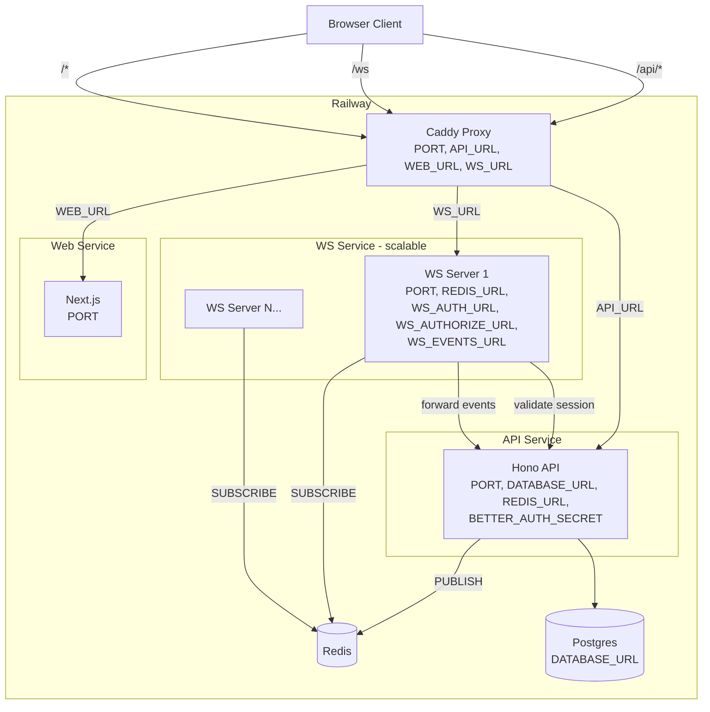

# WebSocket Server Design

A standalone Bun WebSocket server that acts as a stateless pub/sub relay between clients and the API, using Redis for horizontal scaling.

## Architecture Overview



## Responsibilities

### Caddy (Reverse Proxy)
- Entry point for all traffic
- Routes by path: `/api/*` → API, `/ws` → WS server, `/*` → Web
- Handles WebSocket upgrade transparently (native `reverse_proxy` support)
- Serves error/loading pages when services are starting up
- Knows nothing about Redis

### WS Server (Stateless Relay)
- Manages WebSocket connections for its instance
- Authenticates connections by calling the API (`GET /api/auth/get-session`)
- Authorizes topic subscriptions by calling the API (`POST /api/ws/authorize`)
- Forwards client messages to the API (`POST /api/ws/events`)
- Subscribes to Redis channels on behalf of local clients
- Fans out Redis messages to locally connected clients
- Contains zero business logic

### API (Stateless HTTP)
- Processes business logic, talks to the database
- Validates sessions and topic access for the WS server
- Receives forwarded client messages, processes them
- Publishes events to Redis when clients need to be notified
- Uses Redis for `PUBLISH` only — never subscribes

### Redis (Pub/Sub Backbone)
- Enables horizontal scaling of WS server instances
- When the API publishes to a channel, all subscribed WS instances receive it
- Each WS instance fans out to its own local clients
- Channels map 1:1 to topic names (topic `chat:general` = Redis channel `chat:general`)
- A single Redis instance handles hundreds of thousands of channels and ~500K+ messages/second

### Railway Load Balancer
- When the WS service has multiple replicas, distributes new WebSocket connections across them
- Once a connection is established, it stays pinned to that instance
- On reconnect, clients can land on any instance — Redis ensures they get the same messages

## Project Structure

```
apps/ws/
├── src/
│   ├── index.ts          # Bun.serve() entry point with WebSocket handlers
│   ├── auth.ts           # Session validation (calls API)
│   ├── redis.ts          # Redis subscribe/publish client
│   ├── topics.ts         # Topic subscription manager (tracks local clients per topic)
│   └── protocol.ts       # Message type definitions and parsing
├── railway.json
├── Dockerfile
├── package.json
└── tsconfig.json
```

Dependencies: `ioredis` (Redis client with pub/sub support). No Hono, no DB, no auth libraries.

### API Route Structure Change

The existing API has all routes in `app.ts`. As part of this work, introduce a `src/routes/` directory:

```
apps/api/src/
├── routes/
│   └── ws.ts             # /api/ws/authorize and /api/ws/events endpoints
├── lib/
│   ├── auth.ts
│   └── redis.ts          # Redis publish client (new)
├── app.ts                # Mounts route files, keeps middleware/health
└── index.ts              # Entry point
```

The existing auth route (`/auth/**`) stays in `app.ts` since it's a direct better-auth handler pass-through, not a standard route file. New routes go in `src/routes/`.

## Connection & Auth Flow

1. Client does `new WebSocket('wss://myapp.com/ws')` — browser sends cookies automatically
2. Bun's `fetch` handler receives the upgrade request with full headers
3. WS server extracts the cookie header, makes `GET` to the API's `/api/auth/get-session` forwarding the cookies
4. If valid, calls `server.upgrade(request, { data: { userId, sessionId } })` — user identity attached for the connection lifetime
5. If invalid, returns `401` — connection never upgrades

On disconnect, the WS server cleans up: unsubscribes from any Redis channels that no longer have local clients.

Reconnection is the client's responsibility. The `useWebSocket` hook handles this with exponential backoff. On reconnect, the client re-subscribes to its topics on whatever instance it lands on.

## Message Protocol

All messages are JSON.

### Client → Server

```json
{ "type": "subscribe", "topic": "chat:room-42" }
{ "type": "unsubscribe", "topic": "chat:room-42" }
{ "type": "message", "topic": "chat:room-42", "data": { ... } }
```

### Server → Client

```json
{ "type": "subscribed", "topic": "chat:room-42" }
{ "type": "unsubscribed", "topic": "chat:room-42" }
{ "type": "event", "topic": "chat:room-42", "data": { ... } }
{ "type": "error", "code": "unauthorized", "message": "Not allowed to join this topic" }
```

### Message Handling

**`subscribe`:** WS server calls `POST /api/ws/authorize` with `{ topic, userId }`. If approved, subscribes to the Redis channel (if not already subscribed by another local client) and sends `{ type: "subscribed" }`. If denied, sends `{ type: "error", code: "unauthorized" }`.

**`unsubscribe`:** WS server removes the client from local topic tracking. If no more local clients are subscribed, unsubscribes from the Redis channel. Sends `{ type: "unsubscribed" }`.

**`message`:** WS server forwards to `POST /api/ws/events` with `{ topic, data, userId }`. The API processes business logic and publishes results to Redis if needed. The WS server never publishes client messages directly to Redis — the API is always in the loop.

**Redis event received:** WS server fans out `{ type: "event", topic, data }` to all locally connected clients subscribed to that topic.

## Redis Integration

Each WS server instance creates two Redis connections:
- One for **subscribing** (a Redis client in subscribe mode can't do other commands)
- One for **publishing** (for server-initiated messages like disconnect notifications)

The API creates one Redis connection for publishing only.

### Subscribe/Unsubscribe Lifecycle

- First local client subscribes to `chat:general` → WS server does `SUBSCRIBE chat:general` on Redis
- More local clients subscribe to same topic → just added to local tracking, no Redis call
- Last local client unsubscribes from `chat:general` → WS server does `UNSUBSCRIBE chat:general` on Redis
- Reference counting per topic per instance

### When Does the API Publish?

Any time something happens that clients need to know about in real-time:
- A user sends a chat message → API saves it, publishes to `chat:room-42`
- A cron job detects a game turn timer expired → API publishes to `game:123`
- An admin bans a user → API publishes to `user:456`
- A webhook from Stripe confirms payment → API publishes to `user:456`

## Environment Variables

### Local Development (`.env` at repo root)

New variables added to `.env.example`:
```
# Redis
REDIS_URL=redis://localhost:6379

# WebSocket server (WS reads PORT from its dev script, not from .env)
WS_AUTH_URL=http://localhost:3001/api/auth/get-session
WS_AUTHORIZE_URL=http://localhost:3001/api/ws/authorize
WS_EVENTS_URL=http://localhost:3001/api/ws/events
```

Note: The WS server's dev script sets `PORT=3002` explicitly to avoid conflicting with the API's `PORT=3001` in the shared `.env`. In Railway, `PORT` is injected per-service automatically.

### Railway Production (per-service)

| Variable | Caddy | API | WS Server | Web |
|---|---|---|---|---|
| `PORT` | Railway sets | Railway sets | Railway sets | Railway sets |
| `API_URL` | yes | - | - | - |
| `WEB_URL` | yes | - | - | - |
| `WS_URL` | yes | - | - | - |
| `REDIS_URL` | - | yes | yes | - |
| `DATABASE_URL` | - | yes | - | - |
| `BETTER_AUTH_SECRET` | - | yes | - | - |
| `WS_AUTH_URL` | - | - | yes | - |
| `WS_AUTHORIZE_URL` | - | - | yes | - |
| `WS_EVENTS_URL` | - | - | yes | - |

In Railway, `WS_AUTH_URL` / `WS_AUTHORIZE_URL` / `WS_EVENTS_URL` point to the API's internal Railway URL (private networking, no public internet hop).

The web client connects to `/ws` on the same domain (Caddy routes it) — no WS-specific env var needed.

## Caddyfile Changes

New `/ws` route between `/api/*` and the catch-all:

```
handle /ws {
    reverse_proxy {$WS_URL} {
        header_up X-Real-Client-IP {http.request.header.X-Real-IP}
    }
}
```

New error handler for `/ws`:
```
@ws path /ws
handle @ws {
    header Content-Type application/json
    respond `{"error":"WebSocket service is starting up","retryAfter":3}` 503
}
```

## Railway Deployment

### `apps/ws/railway.json`

```json
{
  "build": {
    "builder": "DOCKERFILE",
    "dockerfilePath": "Dockerfile",
    "watchPatterns": ["/apps/ws/**"]
  },
  "deploy": {
    "runtime": "V2",
    "numReplicas": 1,
    "sleepApplication": false,
    "restartPolicyType": "ON_FAILURE",
    "restartPolicyMaxRetries": 10
  }
}
```

`numReplicas: 1` as default — bump up for horizontal scaling. Redis pub/sub makes it work automatically.

### `apps/ws/Dockerfile`

```dockerfile
FROM oven/bun:1-alpine
WORKDIR /app
COPY package.json bun.lock ./
RUN bun install --frozen-lockfile --production
COPY src ./src
EXPOSE 3002
CMD ["bun", "src/index.ts"]
```

### Docker Compose Addition (Local Dev)

```yaml
redis:
  image: redis:7-alpine
  ports:
    - "6379:6379"
```

## Chat Example

A minimal chat app demonstrating the full data flow. Two users, one shared room, real-time messages. No message persistence — messages only exist while you're connected.

### Seed Script

`scripts/seed.ts` creates two pre-verified users:
- `alice` / `alice@test.com` / `password123`
- `bob` / `bob@test.com` / `password123`

Run via `bun run seed`.

### API Example Endpoints

**`POST /api/ws/authorize`** — Example logic: allows any authenticated user to subscribe to topics matching `chat:*`.

```typescript
// In production you would:
//   - Check if the user has access to this specific resource
//   - Validate the topic format against your domain model
//   - Check database permissions (e.g., room membership, team access)
```

**`POST /api/ws/events`** — Example logic: echoes the chat message back to all subscribers via Redis PUBLISH.

```typescript
// In production you would:
//   - Validate the message payload (schema, size, content)
//   - Apply rate limiting per user
//   - Store the event in the database
//   - Transform/enrich the data before publishing
//   - Publish to additional topics if needed (e.g., notifications)
```

### Web Example Page

`/chat` — A single room (`chat:general`), text input, message list. Uses the `useWebSocket` hook.

### What's Example vs Infrastructure

**Example code (remove when building your app):**
- `apps/web/src/app/chat/` — example chat page
- Chat-specific logic inside `/api/ws/authorize` and `/api/ws/events` (replace the logic, keep the endpoints)
- `scripts/seed.ts` — example seed users

**Infrastructure (keep):**
- `apps/ws/` — the entire WebSocket server
- `/api/ws/authorize` and `/api/ws/events` endpoints (replace the logic inside)
- `apps/web/src/hooks/use-websocket.ts` — WebSocket client hook with reconnect

### LLM Snippet

Copy-paste this into your prompt when working with an LLM on this project:

````
## WebSocket Architecture

This project has a standalone WebSocket server at apps/ws/.
It is a stateless relay — it does NOT contain business logic.

Data flow:
1. Client connects to /ws (Caddy proxies to WS server)
2. WS server validates session by calling GET {WS_AUTH_URL} with the client's cookies
3. Client sends { type: "subscribe", topic: "..." } — WS server calls POST {WS_AUTHORIZE_URL} to check access
4. Client sends { type: "message", topic: "...", data: {...} } — WS server forwards to POST {WS_EVENTS_URL}
5. API processes business logic and does PUBLISH to Redis
6. All WS server instances subscribed to that topic fan out to their local clients

Message protocol (client → server):
  { type: "subscribe", topic: string }
  { type: "unsubscribe", topic: string }
  { type: "message", topic: string, data: any }

Message protocol (server → client):
  { type: "subscribed", topic: string }
  { type: "unsubscribed", topic: string }
  { type: "event", topic: string, data: any }
  { type: "error", code: string, message: string }

To add a new real-time feature:
1. Add authorization logic in POST /api/ws/authorize for your new topic pattern
2. Add event handling in POST /api/ws/events for messages on that topic
3. Use Redis PUBLISH from anywhere in the API to push events to clients
4. Subscribe to the topic from the client using the useWebSocket hook

Do NOT modify apps/ws/ for business logic. All domain logic belongs in apps/api/.
````
